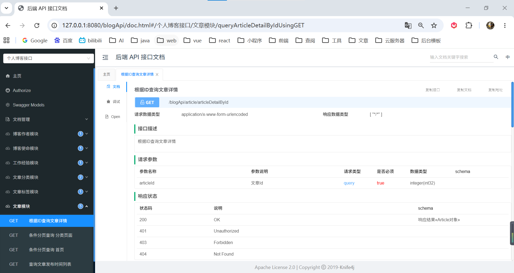

# 个人博客 API 接口

基于 Spring Boot + MyBatis-Plus + MySQL + Redis 构建的博客展示页后端服务。  

> 博客在线预览 https://pzhdv.cn

### 项目仓库
- 前端：https://github.com/pzhdv/blog
- 前端 API：https://github.com/pzhdv/blog-api
- 后台管理：https://github.com/pzhdv/blog-admin
- 后台 API：https://github.com/pzhdv/blog-admin-api

---

## 📖 项目简介

本项目是个人博客系统的核心 API 服务，为前台博客网站提供以下接口服务：

- 📝 文章管理接口
- 🏷️ 分类与标签管理
- 👤 作者信息展示
- 💼 工作经历展示

---

## 🛠️ 技术栈

| 技术 | 版本 | 说明 |
|:---|:---:|:---|
| **Spring Boot** | 2.7.6 | 后端框架 |
| **MyBatis-Plus** | 3.5.15 | ORM 框架 |
| **MySQL** | 8.0+ | 关系型数据库 |
| **Redis** | 7.0+ | 缓存数据库 |
| **Knife4j** | 3.0.3 | API 文档工具 |
| **Lombok** | (由 Spring Boot 管理) | 简化实体类代码 |

---


## 📚 API 接口文档

启动服务后访问 API 文档地址：

🔗 **http://localhost:8080/blogApi/doc.html**

> 🔐 认证信息：`pzh` / `pzh`

**文档如图所示**



---

## 🏗️ 项目结构

```
blog-api/
├── src/main/java/cn/pzhdv/blog/
│   ├── config/              # 配置类
│   │   ├── CrossConfig.java         # 跨域配置
│   │   ├── EntityMetaHandler.java   # 实体元数据处理器
│   │   ├── FileSizeConfig.java      # 文件大小配置
│   │   ├── Knife4jConfig.java       # Knife4j 配置
│   │   ├── MybatisPlusConfig.java   # MyBatis-Plus 配置
│   │   └── RedisConfig.java         # Redis 配置
│   ├── constant/           # 常量定义
│   │   └── RedisKey.java            # Redis 缓存 Key 常量
│   ├── controller/         # 控制器层
│   │   ├── ArticleController.java            # 文章接口
│   │   ├── ArticleCategoryController.java    # 分类接口
│   │   ├── ArticleTagController.java         # 标签接口
│   │   ├── BlogAuthorController.java         # 作者信息接口
│   │   ├── BlogMissionController.java        # 博客使命接口
│   │   └── JobExperienceController.java      # 工作经历接口
│   ├── entity/             # 实体类
│   │   ├── Article.java                  # 文章实体
│   │   ├── ArticleCategory.java          # 文章分类实体
│   │   ├── ArticleCategoryRelation.java   # 文章分类关联实体
│   │   ├── ArticleTag.java               # 文章标签实体
│   │   ├── ArticleTagRelation.java       # 文章标签关联实体
│   │   ├── BlogAuthor.java               # 博客作者实体
│   │   ├── BlogMission.java               # 博客使命实体
│   │   └── JobExperience.java             # 工作经历实体
│   ├── help/              # 辅助工具
│   │   └── MPCodeGenerator.java         # MyBatis-Plus 代码生成器
│   ├── mapper/             # 数据访问层
│   │   ├── ArticleMapper.java
│   │   ├── ArticleCategoryMapper.java
│   │   ├── ArticleCategoryRelationMapper.java
│   │   ├── ArticleTagMapper.java
│   │   ├── ArticleTagRelationMapper.java
│   │   ├── BlogAuthorMapper.java
│   │   ├── BlogMissionMapper.java
│   │   └── JobExperienceMapper.java
│   ├── service/            # 业务逻辑层
│   │   ├── ArticleService.java
│   │   ├── ArticleCategoryService.java
│   │   ├── ArticleCategoryRelationService.java
│   │   ├── ArticleTagService.java
│   │   ├── ArticleTagRelationService.java
│   │   ├── BlogAuthorService.java
│   │   ├── BlogMissionService.java
│   │   ├── JobExperienceService.java
│   │   └── impl/           # 业务逻辑实现
│   ├── result/             # 统一响应处理
│   │   ├── Result.java             # 统一响应体
│   │   ├── ResultCode.java         # 响应状态码
│   │   └── ResultUtil.java         # 响应工具类
│   ├── exception/          # 异常处理
│   │   ├── BusinessException.java          # 业务异常
│   │   ├── FileValidationException.java   # 文件校验异常
│   │   └── GlobalExceptionHandler.java    # 全局异常处理器
│   ├── utils/              # 工具类
│   │   ├── RedisUtils.java              # Redis 工具类
│   │   ├── DateUtils.java               # 日期工具类
│   │   └── IpUtils.java                 # IP 工具类
│   └── BlogApplication.java     # 启动类
├── src/main/resources/
│   ├── application.yml             # 主配置文件
│   ├── application-dev.yml         # 开发环境配置
│   ├── application-dev-example.yml # 开发环境配置示例
│   ├── application-prod.yml        # 生产环境配置
│   ├── application-prod-example.yml# 生产环境配置示例
│   ├── mapper/                     # MyBatis XML 映射文件
│   └── logback-spring.xml          # 日志配置
└── pom.xml                         # Maven 依赖配置
```

---

## 🚀 快速开始

### 📌 环境要求

- ☕ JDK 17+
- 🧰 Maven 3.6+
- 🐬 MySQL 8.0+
- ⚙️ Redis 7.0+

### ⚙️ 配置修改

1. 复制配置文件示例文件：

```bash
cp src/main/resources/application-dev-example.yml src/main/resources/application-dev.yml
cp src/main/resources/application-prod-example.yml src/main/resources/application-prod.yml
```

2. 修改数据库连接配置 `src/main/resources/application-dev.yml`：

```yaml
spring:
  datasource:
    driver-class-name: com.mysql.cj.jdbc.Driver
    url: jdbc:mysql://localhost:3306/pzh_blog?useUnicode=true&characterEncoding=utf8&useSSL=false&serverTimezone=UTC&allowPublicKeyRetrieval=true&rewriteBatchedStatements=true
    username: root
    password: your_database_password
```

3. 修改 Redis 配置：

```yaml
spring:
  redis:
    database: 0
    host: 127.0.0.1
    port: 6379
    password: your_redis_password
```

4. 修改跨域配置（可选，配置前端访问地址）：

```yaml
cors:
  allowed-origins: http://localhost:4000
  allow-credentials: true
```

### 📦 打包发布

生产环境需要替换 `application-prod.yml` 中的数据库和 Redis 配置。

```bash
# 打包
mvn clean package

# 运行
java -jar target/blog-api-0.0.1-SNAPSHOT.jar --spring.profiles.active=prod
```

### 💻 开发环境启动

```bash
mvn spring-boot:run
```

---

## 💾 缓存策略

项目使用 Redis 进行数据缓存，主要缓存以下热点数据：

- 📊 文章总数
- 📅 文章发布时间列表
- 🏠 首页文章列表
- 📂 分类页文章列表
- 📄 文章详情
- 👤 作者信息
- 💡 博客使命信息

---

## 📦 统一响应格式

```json
{
  "code": 200,
  "msg": "success",
  "data": {}
}
```

**状态码说明：**

- ✅ `200` - 成功
- ⚠️ `400` - 请求参数错误
- 🔒 `401` - 未授权
- ❌ `500` - 服务器内部错误

---

## 🔧 开发规范

- 🎯 使用 Lombok 简化实体类代码
- 📋 统一使用 Result 封装返回结果
- 🛠️ 使用 MyBatis-Plus 的 CRUD 接口减少样板代码
- ⚡ 使用 Redis 缓存热点数据提升性能
- 📖 使用 Knife4j 生成清晰的 API 文档

---


## 📜 许可证

本项目采用 MIT 许可证 - 查看 [LICENSE](LICENSE) 文件了解详情

---

## 👨‍💻 作者

- 🧩 **潘宗晖 (PanZonghui)**
- 🌐 **博客**: https://pzhdv.cn
- 📧 **邮箱**: 1939673715@qq.com
- 🐙 **GitHub**: https://github.com/pzhdv

---

## 🙏 致谢

感谢以下开源项目的贡献：

- **[Spring Boot](https://spring.io/projects/spring-boot)** — 后端框架
- **[MyBatis Plus](https://baomidou.com/)** — ORM 框架
- **[Knife4j](https://doc.xiaominfo.com/)** — API 文档工具
- **[Redis](https://redis.io/)** — 高性能键值存储数据库
- **[MySQL](https://www.mysql.com/)** — 关系型数据库
- **[Lombok](https://projectlombok.org/)** — Java 注解工具，简化代码编写

---

如果这个项目对你有帮助，请给个 ⭐ Star 支持一下！
